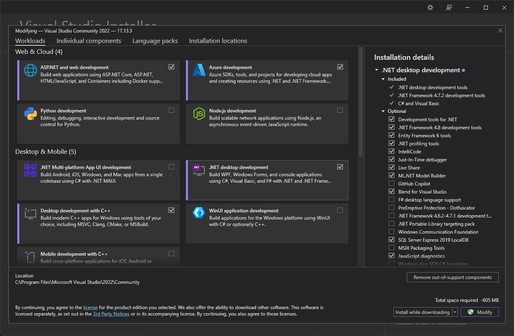
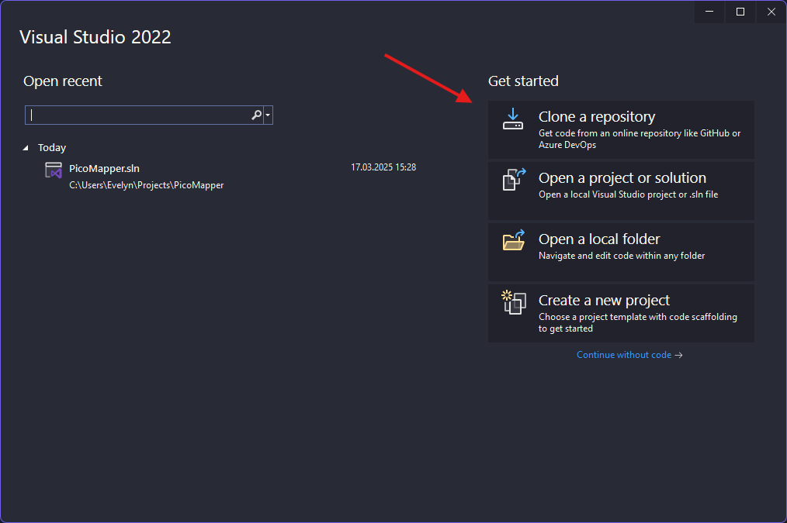
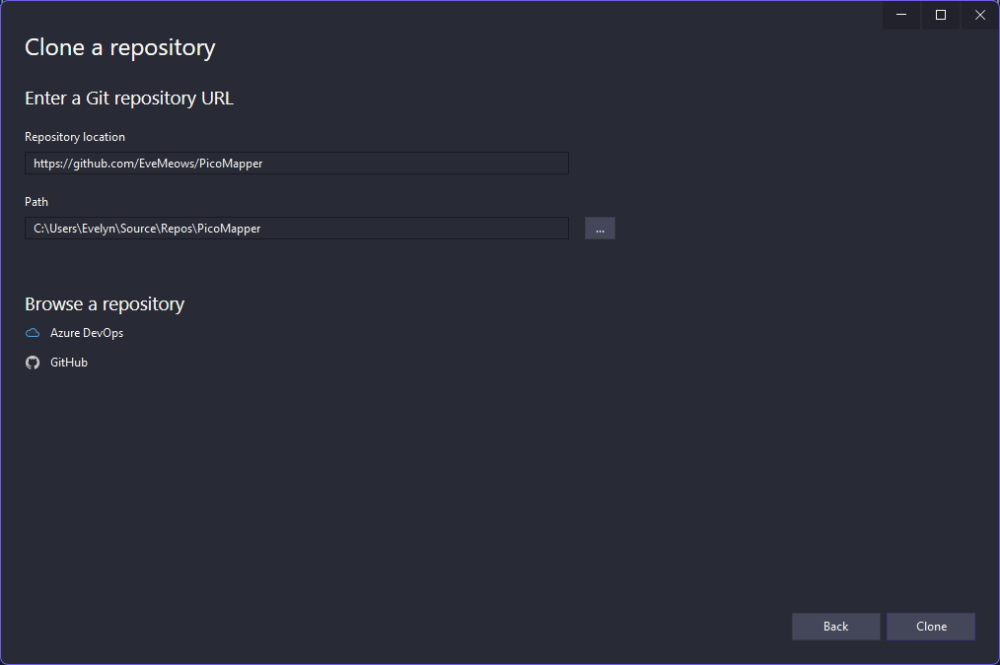
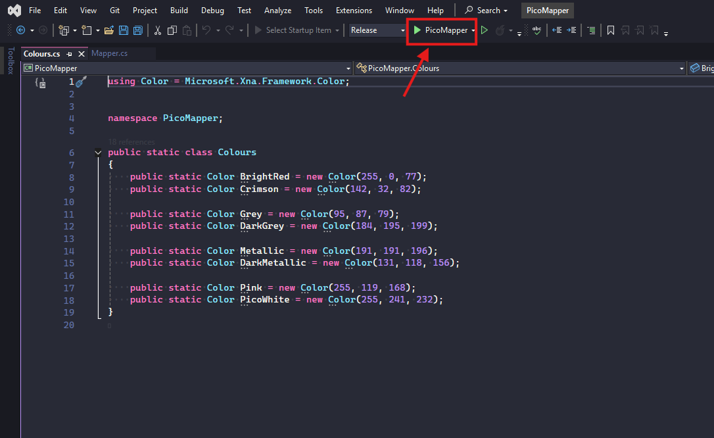

# Installation Instructions

Here, I will explain the steps to download and run PicoMapper, both from release and from scratch.

## Using release (recommended)

You can either download the game from [itch.io](https://eve-meows.itch.io/PicoMapper) or from the [releases page](https://github.com/EveMeows/PicoMapper/releases)!
Simply click one of the links and download the latest version from the site. And you're good to go! No installation required!

## Compiling (advanced)
If you wish to compile and maybe contribute to this project, here are instructions on how to compile!

### Downloading visual studio
First, you must download Visual Studio 2022. Head over to the [official site](https://visualstudio.microsoft.com/), and click "Download Visual Studio".

Run "VisualStudioSetup.exe". Once the setup finishes, you will see a window akin to the one below.

Click ".NET desktop development" then at the bottom right corner, click the button with the Administrator Shield (it may have different text).

After the installer is done, you should be able to just start Visual Studio!

### Running the application
Time to compile and run the application.

Open Visual Studio. You should see something like this.

Click the "Clone a repository" button.

On the next screen, paste "https://github.com/EveMeows/PicoMapper" into the "Repository location" field. You are free to change the "Path" field however you like.

Click "Clone"

Once the editor is done thinking, you will see an empty window. At the top left corner to middle centre you should see a green button, with the project name next to it.

Click it. And done! You can now edit the code and run the application as you please!