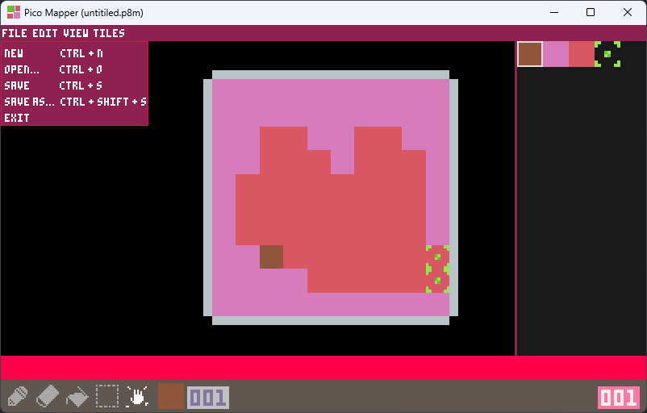

# PicoMapper

PicoMapper is a Pico8-like TileMap Editor for Windows!

## Showcase

Get it on [itch](https://eve-meows.itch.io/pico-mapper)!

## Credits
The Pico8 is created by Zep under [LexalOffle](https://www.lexaloffle.com/)!

I, in no way claim I am the original creator of the console, I'm just a lonely trans girl who likes the simplicity of the original TileMap Editor.

## Install
Installation instructions can be found [here](./Documentation/Install.md)!

## License
This program is licensed under MIT.
